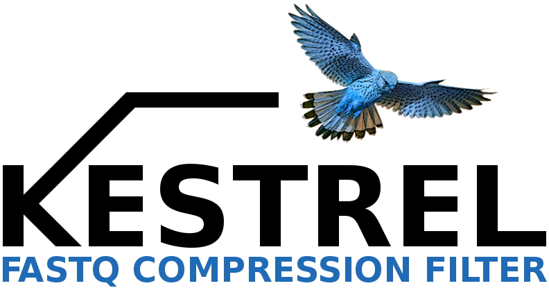

&nbsp;

A compression method to filter FASTQ reads by relative similarity. Currently, KESTREL runs on a command line environment. It reports into the output file the reads with similarity relatively to a reference, using compression technology. KESTREL can run in a <b>multi-thread mode</b> to minimize computation times.

## INSTALLATION ##

Cmake is needed for installation (http://www.cmake.org/). You can download it directly from http://www.cmake.org/cmake/resources/software.html or use an appropriate packet manager. In the following instructions we show the procedure to install and compile: 

<pre>
#sudo apt-get install cmake
git clone https://github.com/pratas/kestrel.git
cd kestrel/src/
cmake .
make
</pre>

## CITATION ##

On using this software/method, please cite:

Paper submitted.

## ISSUES ##

For any issue let us know at [issues link](https://github.com/pratas/kestrel/issues).

## LICENSE ##

GPL v3.

For more information:
<pre>http://www.gnu.org/licenses/gpl-3.0.html</pre>

